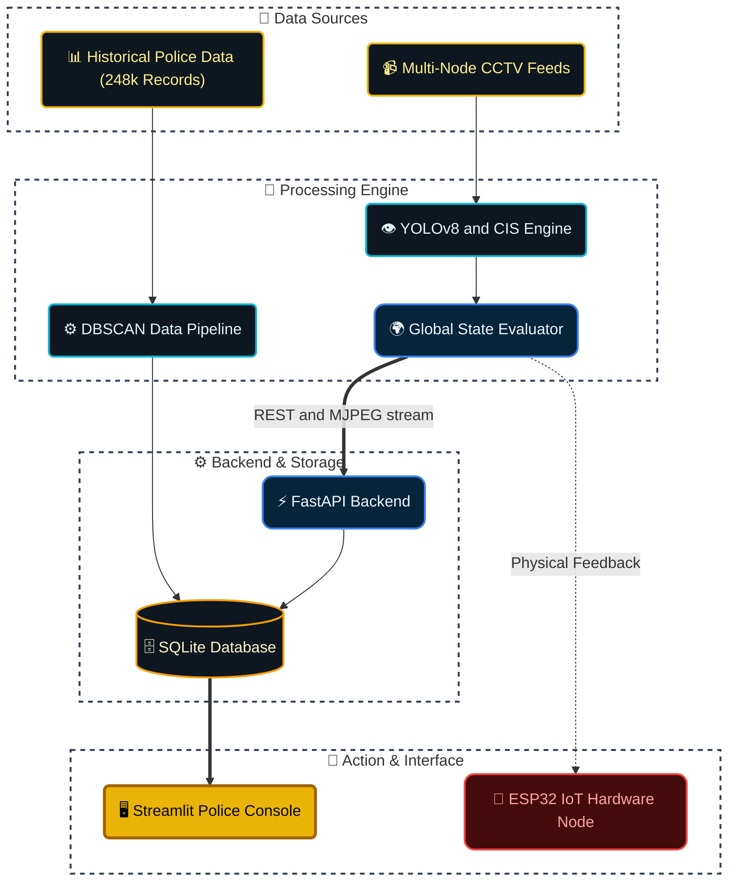

<div align="center">


<br/>

<a href="https://git.io/typing-svg"></a>

<br/>

<p>
  
  
  
</p>

<p>
  
  
  
  
  
  
</p>

<br/>

**[Dashboard](#-platform-modules)** &nbsp;·&nbsp;
**[Architecture](#-architecture)** &nbsp;·&nbsp;
**[Quick Start](#-quick-start)**

</div>

<br/>

---

## 🎯 Mission Brief

Currently, traffic police patrol blindly. They waste time giving tickets on quiet backstreets while a single truck completely blocks a main road.

**ParkIQ** transforms raw illegal-parking violation records into **prioritised, actionable enforcement intelligence** for Traffic Police. It answers the question that actually matters:

> *"How much congestion is this specific violation causing, and which ones should officers clear first?"*

Built for **GridLock Hackathon 2.0**, it functions as a command-center decision support tool powered by historical data and real-time YOLOv8 multi-camera inference.

<table>
<tr>
<td width="25%" align="center"><b>Track</b><br/><sub>Monitor physical zones with YOLOv8</sub></td>
<td width="25%" align="center"><b>Score</b><br/><sub>Calculate Congestion Impact Score (CIS)</sub></td>
<td width="25%" align="center"><b>Sync</b><br/><sub>Evaluate global state & trigger IoT alerts</sub></td>
<td width="25%" align="center"><b>Act</b><br/><sub>Dispatch tow trucks to critical hotspots</sub></td>
</tr>
</table>

---

## 🏗️ Architecture



**Data flow:** Live multi-node CCTV feeds pass through a YOLOv8 engine which tracks, scores, and measures time. Historical police data goes through a feature engineering pipeline for DBSCAN hotspot clustering. The outputs fuse into a FastAPI backend and SQLite DB, instantly updating the Streamlit police console and signalling physical ESP32 IoT nodes in the real world.

---

## 🧠 Core Innovation — Congestion Impact Score (CIS)

Instead of a binary "illegal/legal" status, every violation receives a real-time **Congestion Impact Score**:

```
CIS = ( BaseVehicleWeight + ZonePenalty + LaneBlockagePenalty ) × TimeOfDayFactor
```

*Note: The **Lane Blockage Penalty** dynamically calculates the vehicle's bounding-box width relative to the physical road width. The **TimeOfDayFactor** applies a 1.3x multiplier during rush hour and 0.5x during night hours!*

| CIS Range | Hardware Trigger (Global Highest Priority) | Action |
|---|---|---|
| **0–40** | None / 🟢 Green LED (Vacant/Low) | Monitor only |
| **41–70** | 🟡 Solid Yellow LED | Dispatch patrol for e-challan |
| **71–100** | 🔴 Solid Red + Buzzer | Emergency heavy-tow clearance |

---

## 🖥️ Platform Modules

| Module | Function |
|---|---|
| 🧠 **AI Predictive Impact Map** | Predictive mapping using historical data. Features dynamic time-range sliders, real-time dispatch directives, and **Live Zone Analytics**. |
| ⚠️ **High-Risk Area Analysis** | Top-10 congestion hotspots, AI-generated resolution policies, and macro-level city metrics. |
| 🌐 **City-Wide CCTV Network** | Real-time live feed monitoring across distributed nodes. Stabilized responsive video grids. |
| 📡 **IoT Sensor Monitor** | Live hardware feed from ESP32 nodes indicating Vacant/Occupied/Violation states. |

*(A global `🚨 Live Alert` threat monitor runs constantly in the background, simulating a massive network of 200,000 cameras to push critical tow-truck dispatch toasts to the user).*

---

## 📸 Screenshots

<div align="center">

<table>
<tr>
<td width="50%" align="center" valign="top">
<b>Predictive Impact Map</b><br/><br/>

</td>
<td width="50%" align="center" valign="top">
<b>High-Risk Hotspots</b><br/><br/>

</td>
</tr>
<tr>
<td width="50%" align="center" valign="top">
<b>Live CCTV Network</b><br/><br/>

</td>
<td width="50%" align="center" valign="top">
<b>IoT Sensor Monitor</b><br/><br/>

</td>
</tr>
</table>

</div>

---

## 🛠️ Tech Stack

<div align="center">

<table>
<tr><th>Layer</th><th>Stack</th></tr>
<tr>
<td><b>Frontend (Dashboard)</b></td>
<td>


</td>
</tr>
<tr>
<td><b>Backend</b></td>
<td>


</td>
</tr>
<tr>
<td><b>Computer Vision & AI</b></td>
<td>


</td>
</tr>
<tr>
<td><b>Hardware / IoT</b></td>
<td>


</td>
</tr>
</table>

</div>

---

## 📂 Repository Structure

```
GridLock/ParkIQ/
│
├── src/
│   ├── dashboard.py       # Streamlit Dashboard (Map, Analytics, CCTV Network)
│   ├── backend_api.py     # FastAPI backend (REST + MJPEG stream)
│   ├── cctv_detector.py   # Distributed Multi-Cam YOLOv8 + CIS engine
│   └── data_pipeline.py   # Feature Eng. + DBSCAN Hotspots + CIS Scoring
│
├── iot/
│   └── esp32_firmware/
│       └── esp32_multi_sensor/
│           └── esp32_multi_sensor.ino   # Arduino hardware firmware
│
├── data/
│   ├── violations.csv           # Raw Jan-May Police dataset (248k records)
│   ├── violations_scored.csv    # CIS-scored output
│   └── parkiq.db                # Real-time SQLite database
│
├── yolov8n.pt                   # YOLOv8 Nano weights
├── requirements.txt
├── ParkIQ_Architecture.md       # Architecture spec
└── README.md                    # This file
```

---

## ⚡ Quick Start

### 1. Install Dependencies
```bash
pip install -r requirements.txt
```

### 2. Score the Dataset (AI Processing)
```bash
python src/data_pipeline.py
```
*Parses 5 months of Bangalore Police data (248k records), clusters hotspots using DBSCAN, and calculates Congestion Impact Scores (CIS).*

### 3. Start the Backend API
```bash
python src/backend_api.py
```

### 4. Launch the AI Dashboard
```bash
streamlit run src/dashboard.py
```

### 5. Launch Distributed CCTV AI Cameras
You can run multiple independent cameras tracking different specific physical zones simultaneously!

**Run Camera 1:**
```bash
python src/cctv_detector.py --device-id "CCTV-CAM-01"
```

**Run Camera 2 (using your 2nd Phone IP):**
```bash
python src/cctv_detector.py --source "http://192.168.29.100:8080/video" --device-id "CCTV-CAM-02"
```

### 6. Calibrate Road Width & No-Parking Zones
To precisely map physical road dimensions and custom no-parking polygons for your hardware setup:

1. Run the calibration mode for Camera 1:
   ```bash
   python src/cctv_detector.py --device-id "CCTV-CAM-01" --calibrate
   ```
2. A window will open. **Click 2 points** on the LEFT and RIGHT edges of the road to set the road width.
3. **Click the 4 corners** of each no-parking zone. Press `ENTER`.
4. The terminal will print out a dictionary string.
5. Copy that string and paste it into the `ROAD_CONFIG` variable inside `src/cctv_detector.py` (around line 66).
6. Repeat the exact same process for Camera 2 by changing the device-id to `"CCTV-CAM-02"` and specifying the source!

---

## ⚠️ Honest Limitations
- No real congestion ground truth in dataset → explainable heuristic CIS (not black-box ML).
- YOLOv8 Nano has been optimized with lowered confidence thresholds and strict IoU tracking for small vehicles, but extreme occlusion in dense traffic may still cause ID swaps.
- ESP32 demo node = 1 zone proof-of-concept (production: LoRaWAN fleet).

<div align="center">

### From Parking Violations to Congestion Intelligence.

<br/>


<sub>Built for GridLock Hackathon 2.0</sub>

</div>
